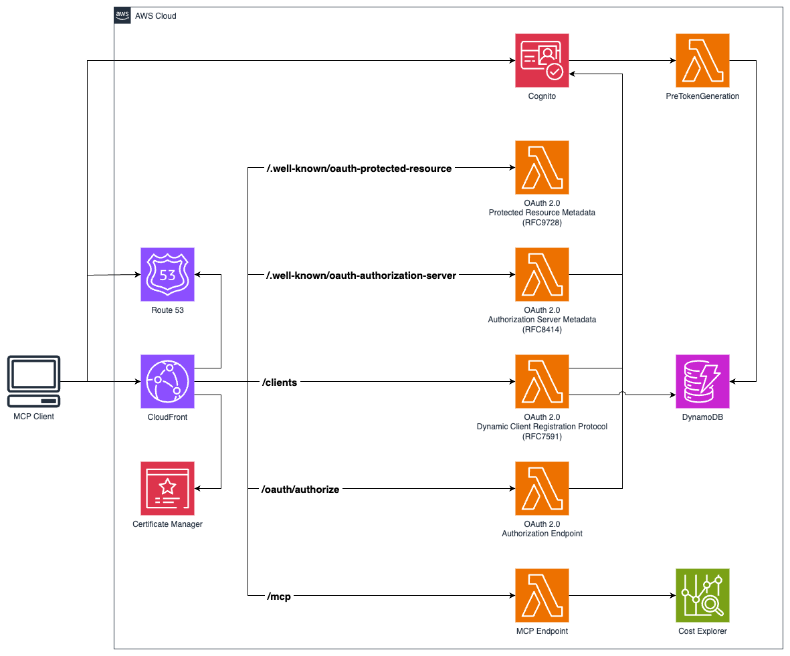

# Serverless MCP

A serverless implementation of the Model Context Protocol (MCP) using AWS Lambda, CloudFront, and Cognito authentication. This project provides a complete infrastructure for hosting MCP servers in the cloud with OAuth 2.0 authentication, real-time streaming via Server-Sent Events with JSON-RPC 2.0 messaging format, and scalable serverless architecture. The implementation includes RFC-compliant OAuth 2.0 support with OAuth 2.0 Authorization Server Metadata (RFC 8414), OAuth 2.0 Dynamic Client Registration Protocol (RFC 7591), and OAuth 2.0 Protected Resource Metadata (RFC 9728). Features a custom transport implementation compatible with the official Model Context Protocol TypeScript SDK.

## Features

- **MCP Protocol Implementation**: Full support for Model Context Protocol with tools and resources
- **Serverless Architecture**: AWS Lambda functions with CloudFront distribution
- **OAuth 2.0 Authentication**: Secure authentication using AWS Cognito
- **Real-time Streaming**: Server-Sent Events (SSE) support for live communication
- **Session Management**: Stateful and stateless session handling
- **Custom Domain**: SSL certificates and Route 53 DNS configuration
- **GitHub Actions Deployment**: OIDC-based CI/CD pipeline

## Architecture

The project consists of two main CDK stacks:

1. **ServerlessMcpStack**: Core infrastructure including Lambda functions, CloudFront distribution, Cognito user pool, and DynamoDB table
2. **GitHubOidcStack**: GitHub Actions OIDC provider for secure deployments



## Prerequisites

- Node.js 22
- pnpm >= 10.12
- AWS CLI configured with appropriate permissions
- A registered domain name with Route 53 hosted zone

## Installation

1. Clone the repository:

```bash
git clone https://github.com/hteek/serverless-mcp.git
cd serverless-mcp
```

2. Install dependencies:

```bash
pnpm install
```

3. Configure your domain settings in `config/default.ts`:

```typescript
export default {
  domainName: 'your-domain.com',
  github: {
    owner: 'your-github-username',
    repo: 'your-repo-name',
  },
  hostedZoneId: 'YOUR_ROUTE53_HOSTED_ZONE_ID',
  project: 'your-project-name',
};
```

## Development

### Build and Test

```bash
# Build the project
pnpm build

# Watch for changes during development
pnpm watch

# Run tests
pnpm test

# Run tests in watch mode
pnpm test:watch

# Run tests with UI
pnpm test:ui
```

### Code Quality

```bash
# Lint code
pnpm lint

# Fix linting issues
pnpm lint:fix

# Format code
pnpm format

# Check formatting
pnpm format:check
```

## Deployment

### Prerequisites

1. Ensure your AWS credentials are configured
2. Verify your domain is registered and the hosted zone ID is correct
3. Build the project: `pnpm build`

### Manual Deployment

```bash
# Deploy both stacks
pnpm cdk deploy --all

# Deploy specific stack
pnpm cdk deploy serverless-mcp
pnpm cdk deploy serverless-mcp-github-oidc

# Preview changes
pnpm cdk diff

# Generate CloudFormation templates
pnpm cdk synth
```

### GitHub Actions Deployment

This project includes three GitHub Actions workflows for automated deployment:

#### 1. Continuous Integration and Deployment (`ci.yml`)

**Trigger**: Pushes to `main` branch and pull requests

**Jobs**:

- **CI Pipeline**: Runs build, lint, and tests on all pushes and PRs
- **Automated Deployment**: Deploys to AWS when changes are pushed to `main`

**Environment**: Uses `development` environment with `AWS_ACCOUNT` variable

#### 2. Manual Deployment (`manual-deploy.yml`)

**Trigger**: Manual workflow dispatch via GitHub UI

**Usage**: For ad-hoc deployments without code changes

#### 3. Reusable Deploy Workflow (`deploy.yml`)

**Purpose**: Shared deployment logic used by other workflows

**Features**:

- OIDC authentication with AWS
- Installs dependencies and builds project
- Deploys using CDK with no approval required

#### Initial Setup

1. **Deploy GitHub OIDC Stack** (one-time setup):

```bash
pnpm cdk deploy serverless-mcp-github-oidc
```

2. **Configure GitHub Environment**:

   - Go to your GitHub repository → Settings → Environments
   - Create a `development` environment
   - Add environment variable: `AWS_ACCOUNT` with your AWS account ID

3. **Verify Deployment**:
   - The GitHub OIDC stack creates an IAM role: `github-actions-role`
   - This role has the necessary permissions for CDK deployment
   - No long-lived AWS credentials needed in GitHub secrets

#### Deployment Process

**Automatic Deployment**:

1. Push changes to `main` branch
2. CI workflow runs: build → lint → test → deploy
3. Deployment uses OIDC to assume AWS role
4. CDK deploys the `serverless-mcp` stack

**Manual Deployment**:

1. Go to Actions tab in GitHub repository
2. Select "manual deploy" workflow
3. Click "Run workflow" on `main` branch

#### Monitoring Deployments

- **GitHub Actions**: View workflow runs in the Actions tab
- **AWS CloudFormation**: Check stack status in AWS console
- **CloudWatch**: Monitor Lambda function logs and metrics

## Usage

### MCP Server Endpoints

Once deployed, your MCP server will be available at:

- **Main endpoint**: `https://your-domain.com/mcp`
- **Authentication**: `https://auth.your-domain.com`

### Available MCP Tools

The server implements the following AWS Cost Explorer tools:

- **get_today_date**: Get the current date to help with relative date queries
  
  ```json
  {
    "name": "get_today_date"
  }
  ```

- **get_dimension_values**: Get available values for AWS Cost Explorer dimensions (SERVICE, REGION, etc.)
  
  ```json
  {
    "name": "get_dimension_values", 
    "arguments": {
      "dimensionKey": "SERVICE",
      "startDate": "2024-01-01",
      "endDate": "2024-01-31"
    }
  }
  ```

- **get_tag_values**: Get available values for a specific tag key
  
  ```json
  {
    "name": "get_tag_values",
    "arguments": {
      "tagKey": "Environment", 
      "startDate": "2024-01-01",
      "endDate": "2024-01-31"
    }
  }
  ```

- **get_cost_and_usage**: Retrieve AWS cost and usage data with filtering and grouping
  
  ```json
  {
    "name": "get_cost_and_usage",
    "arguments": {
      "startDate": "2024-01-01",
      "endDate": "2024-01-31",
      "granularity": "MONTHLY",
      "groupBy": [{"Type": "DIMENSION", "Key": "SERVICE"}]
    }
  }
  ```

- **get_cost_forecast**: Generate cost forecasts based on historical usage patterns
  
  ```json
  {
    "name": "get_cost_forecast",
    "arguments": {
      "startDate": "2024-02-01", 
      "endDate": "2024-02-29",
      "metric": "UNBLENDED_COST"
    }
  }
  ```

- **get_cost_and_usage_comparisons**: Compare costs between two time periods
  
  ```json
  {
    "name": "get_cost_and_usage_comparisons",
    "arguments": {
      "baseStartDate": "2024-01-01",
      "baseEndDate": "2024-01-31", 
      "comparisonStartDate": "2024-02-01",
      "comparisonEndDate": "2024-02-29"
    }
  }
  ```

- **get_cost_comparison_drivers**: Analyze what drove cost changes between periods
  
  ```json
  {
    "name": "get_cost_comparison_drivers",
    "arguments": {
      "baseStartDate": "2024-01-01",
      "baseEndDate": "2024-01-31",
      "comparisonStartDate": "2024-02-01", 
      "comparisonEndDate": "2024-02-29"
    }
  }
  ```

### Available MCP Resources

- **greeting**: Dynamic greeting resource
  - Template: `greeting://[name]`
  - Example: `greeting://world` returns "Hello, world!"

### Client Connection

Connect to your MCP server using any MCP-compatible client:

```typescript
import { Client } from '@modelcontextprotocol/sdk/client/index.js';
import { StreamableHTTPTransport } from '@modelcontextprotocol/sdk/client/streamableHttp.js';

const transport = new StreamableHTTPTransport('https://your-domain.com/mcp');

const client = new Client(
  { name: 'my-client', version: '1.0.0' },
  { capabilities: {} }
);

await client.connect(transport);
```

## Configuration

### Environment-Specific Settings

Create environment-specific configuration files in the `config/` directory:

- `config/development.ts`
- `config/production.ts`
- `config/staging.ts`

### CDK Context

Modify `cdk.json` to adjust CDK feature flags and behavior.

## Monitoring and Debugging

- **CloudWatch Logs**: Lambda function logs are automatically sent to CloudWatch
- **AWS X-Ray**: Distributed tracing is enabled for performance monitoring
- **Metrics**: Custom metrics are collected using AWS Lambda Powertools

## Security

- **Authentication**: OAuth 2.0 with AWS Cognito
- **HTTPS**: All traffic encrypted with SSL/TLS
- **IAM**: Least privilege access policies
- **Session Management**: Secure session handling with validation

## Contributing

1. Fork the repository
2. Create a feature branch: `git checkout -b feature/new-feature`
3. Make your changes and add tests
4. Run linting and tests: `pnpm lint && pnpm test`
5. Commit your changes: `git commit`
6. Push and create a pull request

## License

This project is licensed under the MIT License - see the LICENSE file for details.

## Support

For issues and questions:

1. Check the [documentation](./CLAUDE.md) for development guidance
2. Open an issue on GitHub
3. Review CloudWatch logs for debugging information

## Useful Commands

- `pnpm build` - Compile TypeScript to JavaScript
- `pnpm watch` - Watch for changes and compile
- `pnpm test` - Run Vitest unit tests
- `pnpm cdk deploy` - Deploy infrastructure to AWS
- `pnpm cdk diff` - Compare deployed stack with current state
- `pnpm cdk synth` - Generate CloudFormation templates
- `pnpm cdk destroy` - Remove all AWS resources
